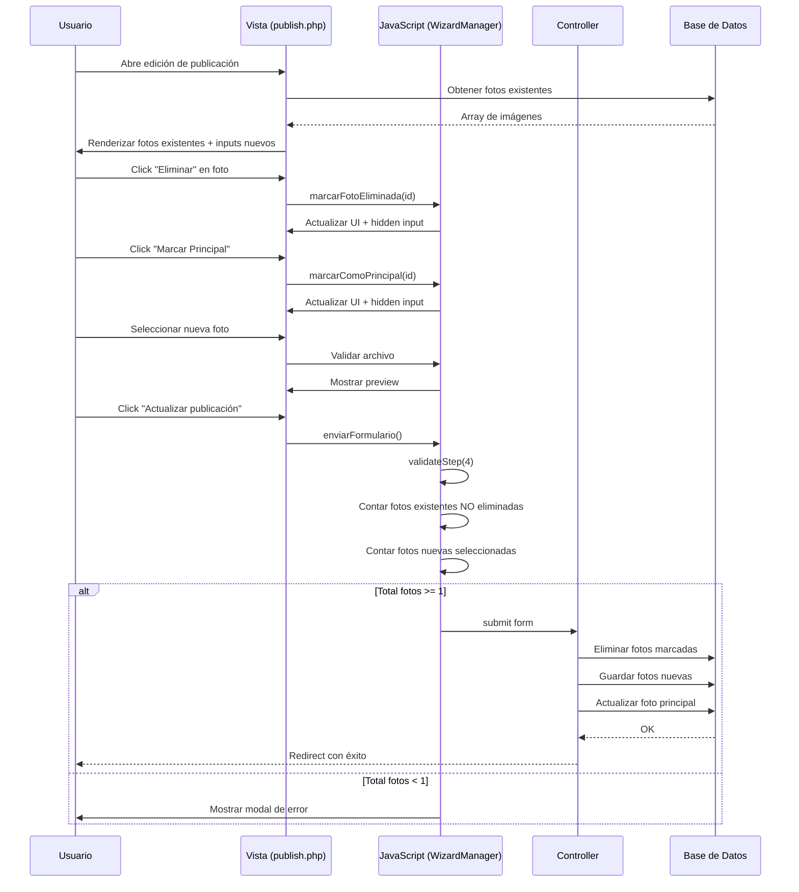

# Diseño Técnico - Fase 1: Gestión de Fotos en Modo Edición

## Fecha: 2025-11-08
## Estado: En Revisión

---

## 1. Resumen Ejecutivo

Este documento detalla el diseño técnico para resolver el problema de gestión de fotos en modo edición de publicaciones. Actualmente, cuando un usuario edita una publicación existente, el sistema muestra las fotos previamente cargadas pero la validación falla incorrectamente solicitando subir al menos 1 foto, a pesar de que ya existen fotos en la publicación.

### Problema Identificado

**Síntoma:** Al intentar guardar una publicación en modo edición (como borrador o actualización), aparece un modal de validación indicando "Al menos 1 foto del vehículo", aunque las fotos existentes se muestran correctamente en la interfaz.

**Causa Raíz:** La lógica de validación en JavaScript no está contando correctamente las fotos existentes. El código busca elementos con clase `.gallery-item` pero las fotos existentes usan la clase `.foto-existente`.

```javascript
// Código actual (INCORRECTO)
const fotosExistentes = document.querySelectorAll('.gallery-item').length;  // ❌ Siempre retorna 0
const fotosNuevas = document.querySelector('input[name="fotos[]"]')?.files.length || 0;
const totalFotos = fotosExistentes + fotosNuevas;
```

---

## 2. Arquitectura de la Solución

### 2.1 Componentes Afectados

```
┌─────────────────────────────────────────────────────────────┐
│                    publish.php (Vista)                       │
│                                                              │
│  ┌────────────────────────────────────────────────────┐    │
│  │  Sección de Fotos Existentes (Modo Edición)       │    │
│  │  - Miniaturas con controles                        │    │
│  │  - Botones: Marcar Principal / Eliminar            │    │
│  │  - Inputs hidden para tracking                     │    │
│  └────────────────────────────────────────────────────┘    │
│                                                              │
│  ┌────────────────────────────────────────────────────┐    │
│  │  Sección de Fotos Nuevas                           │    │
│  │  - Inputs file para subir nuevas fotos             │    │
│  │  - Preview de imágenes seleccionadas               │    │
│  └────────────────────────────────────────────────────┘    │
│                                                              │
│  ┌────────────────────────────────────────────────────┐    │
│  │  JavaScript - WizardManager                        │    │
│  │  - validateStep(4): Validación de fotos           │    │
│  │  - Funciones auxiliares de gestión                 │    │
│  └────────────────────────────────────────────────────┘    │
└─────────────────────────────────────────────────────────────┘
                            │
                            ▼
┌─────────────────────────────────────────────────────────────┐
│          PublicacionController.php (Backend)                 │
│                                                              │
│  - update(): Procesar actualización                         │
│  - Gestionar fotos eliminadas                               │
│  - Procesar fotos nuevas                                    │
│  - Actualizar foto principal                                │
└─────────────────────────────────────────────────────────────┘
```

### 2.2 Flujo de Datos



---

## 3. Diseño Detallado

### 3.1 Estructura HTML de Fotos Existentes

```html
<!-- Contenedor de fotos existentes (solo en modo edición) -->
<div id="fotos-existentes" style="display: grid; grid-template-columns: repeat(3, 1fr); gap: 16px;">
  
  <!-- Cada foto existente -->
  <div class="foto-existente" 
       data-foto-id="123" 
       data-es-principal="1"
       style="position: relative; border: 2px solid #10b981; border-radius: 8px;">
    
    <!-- Imagen -->
    
    
    <!-- Badge "PRINCIPAL" (si aplica) -->
    <div class="badge-principal" style="position: absolute; top: 8px; left: 8px;">
      ★ PRINCIPAL
    </div>
    
    <!-- Botones de acción -->
    <div class="foto-actions" style="position: absolute; bottom: 0; left: 0; right: 0;">
      <button type="button" onclick="marcarComoPrincipal(123)">
        ★ Principal
      </button>
      <button type="button" onclick="eliminarFotoExistente(123)">
        🗑️ Eliminar
      </button>
    </div>
    
    <!-- Inputs hidden para tracking -->
    <input type="hidden" 
           name="fotos_eliminar[]" 
           value="" 
           data-foto-id="123" 
           class="input-eliminar">
    
    <input type="hidden" 
           name="foto_principal_existente" 
           value="123" 
           class="input-principal">
  </div>
  
</div>
```

### 3.2 Lógica JavaScript Mejorada

#### 3.2.1 Función para Eliminar Foto Existente

```javascript
/**
 * Marca una foto existente como eliminada
 * @param {number} fotoId - ID de la foto en la base de datos
 */
function eliminarFotoExistente(fotoId) {
  const fotoDiv = document.querySelector(`.foto-existente[data-foto-id="${fotoId}"]`);
  if (!fotoDiv) return;
  
  // Confirmar acción
  if (!confirm('¿Estás seguro de eliminar esta foto?')) {
    return;
  }
  
  // Marcar visualmente como eliminada
  fotoDiv.style.opacity = '0.3';
  fotoDiv.style.pointerEvents = 'none';
  fotoDiv.classList.add('eliminada');
  
  // Actualizar input hidden para enviar al backend
  const inputEliminar = fotoDiv.querySelector('.input-eliminar');
  if (inputEliminar) {
    inputEliminar.value = fotoId;
  }
  
  // Si era la foto principal, limpiar
  const esPrincipal = fotoDiv.dataset.esPrincipal === '1';
  if (esPrincipal) {
    const inputPrincipal = document.querySelector('input[name="foto_principal_existente"]');
    if (inputPrincipal) {
      inputPrincipal.value = '';
    }
    
    // Intentar marcar otra foto como principal automáticamente
    const primeraFotoNoEliminada = document.querySelector('.foto-existente:not(.eliminada)');
    if (primeraFotoNoEliminada) {
      const nuevoPrincipalId = primeraFotoNoEliminada.dataset.fotoId;
      marcarComoPrincipal(nuevoPrincipalId);
    }
  }
  
  // Actualizar contador en el wizard
  if (window.wizardManager) {
    window.wizardManager.generateSummary(4);
  }
}
```

#### 3.2.2 Función para Marcar como Principal

```javascript
/**
 * Marca una foto existente como principal
 * @param {number} fotoId - ID de la foto en la base de datos
 */
function marcarComoPrincipal(fotoId) {
  // Remover badge "PRINCIPAL" de todas las fotos
  document.querySelectorAll('.foto-existente').forEach(foto => {
    foto.dataset.esPrincipal = '0';
    foto.style.borderColor = '#e5e7eb';
    const badge = foto.querySelector('.badge-principal');
    if (badge) badge.style.display = 'none';
    
    const btnPrincipal = foto.querySelector('button[onclick*="marcarComoPrincipal"]');
    if (btnPrincipal) btnPrincipal.style.display = 'block';
  });
  
  // Marcar la foto seleccionada como principal
  const fotoDiv = document.querySelector(`.foto-existente[data-foto-id="${fotoId}"]`);
  if (fotoDiv && !fotoDiv.classList.contains('eliminada')) {
    fotoDiv.dataset.esPrincipal = '1';
    fotoDiv.style.borderColor = '#10b981';
    
    const badge = fotoDiv.querySelector('.badge-principal');
    if (badge) badge.style.display = 'flex';
    
    const btnPrincipal = fotoDiv.querySelector('button[onclick*="marcarComoPrincipal"]');
    if (btnPrincipal) btnPrincipal.style.display = 'none';
    
    // Actualizar input hidden
    const inputPrincipal = document.querySelector('input[name="foto_principal_existente"]');
    if (inputPrincipal) {
      inputPrincipal.value = fotoId;
    }
  }
}
```

#### 3.2.3 Validación Corregida en WizardManager

```javascript
validateStep(stepNumber) {
  const errors = [];
  const formData = new FormData(this.form);
  
  // ... otras validaciones ...
  
  if (stepNumber === 4) { // Paso de Fotos
    // CORRECCIÓN: Contar fotos existentes NO eliminadas
    const fotosExistentesNoEliminadas = document.querySelectorAll(
      '.foto-existente:not(.eliminada)'
    ).length;
    
    // Contar fotos nuevas seleccionadas
    const fotosNuevas = Array.from(formData.getAll('fotos[]'))
      .filter(f => f.size > 0).length;
    
    const totalFotos = fotosExistentesNoEliminadas + fotosNuevas;
    
    console.log('Validación de fotos:', {
      existentes: fotosExistentesNoEliminadas,
      nuevas: fotosNuevas,
      total: totalFotos
    });
    
    if (totalFotos === 0) {
      errors.push('Debes mantener al menos 1 foto del vehículo');
    }
    
    if (totalFotos > 6) {
      errors.push('No puedes tener más de 6 fotos en total');
    }
  }
  
  return errors;
}
```

#### 3.2.4 Actualización del Resumen en Wizard

```javascript
generateSummary(stepNumber) {
  // ... código existente ...
  
  if (stepNumber === 4) { // Fotos
    // Contar fotos existentes NO eliminadas
    const fotosExistentes = document.querySelectorAll(
      '.foto-existente:not(.eliminada)'
    ).length;
    
    // Contar fotos nuevas
    const fotosNuevas = Array.from(formData.getAll('fotos[]'))
      .filter(f => f.size > 0).length;
    
    const total = fotosExistentes + fotosNuevas;
    
    summary = total > 0 ? `${total} foto${total !== 1 ? 's' : ''}` : '';
  }
  
  summaryElement.textContent = summary;
}
```

### 3.3 Procesamiento Backend

#### 3.3.1 Método update() en PublicacionController

```php
public function update($id)
{
    // ... código de validación existente ...
    
    // PASO 1: Procesar fotos eliminadas
    if (!empty($_POST['fotos_eliminar'])) {
        foreach ($_POST['fotos_eliminar'] as $fotoId) {
            if (!empty($fotoId)) {
                // Obtener ruta de la foto antes de eliminar
                $foto = $this->publicacionModel->getFoto($fotoId);
                
                if ($foto) {
                    // Eliminar archivo físico
                    $rutaCompleta = UPLOAD_PATH . '/publicaciones/' . $foto->ruta;
                    if (file_exists($rutaCompleta)) {
                        unlink($rutaCompleta);
                    }
                    
                    // Eliminar registro de BD
                    $this->publicacionModel->eliminarFoto($fotoId);
                }
            }
        }
    }
    
    // PASO 2: Actualizar foto principal si cambió
    if (!empty($_POST['foto_principal_existente'])) {
        $fotoPrincipalId = (int) $_POST['foto_principal_existente'];
        
        // Desmarcar todas las fotos como principal
        $this->publicacionModel->desmarcarTodasPrincipales($id);
        
        // Marcar la nueva como principal
        $this->publicacionModel->marcarComoPrincipal($fotoPrincipalId);
    }
    
    // PASO 3: Procesar nuevas fotos si existen
    if (!empty($_FILES['fotos']['name'][0])) {
        // Determinar índice de foto principal para nuevas fotos
        $fotoPrincipalNuevaIndex = isset($_POST['foto_principal_nueva']) 
            ? (int) $_POST['foto_principal_nueva'] 
            : null;
        
        $this->procesarImagenes($id, $_FILES['fotos'], $fotoPrincipalNuevaIndex);
    }
    
    // PASO 4: Validar que quede al menos 1 foto
    $fotosRestantes = $this->publicacionModel->contarFotos($id);
    
    if ($fotosRestantes === 0) {
        $_SESSION['error'] = 'Debes mantener al menos 1 foto en la publicación';
        header('Location: ' . BASE_URL . '/publicaciones/' . $id . '/editar');
        exit;
    }
    
    // ... resto del código de actualización ...
}
```

### 3.4 Métodos Nuevos en Modelo Publicacion

```php
/**
 * Obtiene una foto específica por ID
 */
public function getFoto($fotoId)
{
    $sql = "SELECT * FROM publicacion_fotos WHERE id = ?";
    $stmt = $this->db->prepare($sql);
    $stmt->execute([$fotoId]);
    return $stmt->fetch(PDO::FETCH_OBJ);
}

/**
 * Elimina una foto de la base de datos
 */
public function eliminarFoto($fotoId)
{
    $sql = "DELETE FROM publicacion_fotos WHERE id = ?";
    $stmt = $this->db->prepare($sql);
    return $stmt->execute([$fotoId]);
}

/**
 * Desmarca todas las fotos de una publicación como principal
 */
public function desmarcarTodasPrincipales($publicacionId)
{
    $sql = "UPDATE publicacion_fotos SET es_principal = 0 WHERE publicacion_id = ?";
    $stmt = $this->db->prepare($sql);
    return $stmt->execute([$publicacionId]);
}

/**
 * Marca una foto específica como principal
 */
public function marcarComoPrincipal($fotoId)
{
    $sql = "UPDATE publicacion_fotos SET es_principal = 1 WHERE id = ?";
    $stmt = $this->db->prepare($sql);
    return $stmt->execute([$fotoId]);
}

/**
 * Cuenta el número de fotos de una publicación
 */
public function contarFotos($publicacionId)
{
    $sql = "SELECT COUNT(*) as total FROM publicacion_fotos WHERE publicacion_id = ?";
    $stmt = $this->db->prepare($sql);
    $stmt->execute([$publicacionId]);
    $result = $stmt->fetch(PDO::FETCH_OBJ);
    return (int) $result->total;
}
```

---

## 4. Casos de Uso Detallados

### Caso 1: Editar publicación manteniendo todas las fotos

**Precondición:** Publicación tiene 4 fotos existentes

1. Usuario abre edición
2. Sistema muestra 4 fotos existentes + 2 slots para nuevas (máx 6 total)
3. Usuario modifica descripción
4. Usuario click "Actualizar publicación"
5. Validación: 4 fotos existentes + 0 nuevas = 4 total ✓
6. Sistema actualiza publicación
7. Redirect con mensaje de éxito

**Resultado:** Publicación actualizada con las 4 fotos originales

### Caso 2: Eliminar 2 fotos y agregar 1 nueva

**Precondición:** Publicación tiene 4 fotos existentes

1. Usuario abre edición
2. Sistema muestra 4 fotos existentes
3. Usuario click "Eliminar" en foto #2
4. Sistema marca foto #2 como eliminada (opacity 0.3)
5. Usuario click "Eliminar" en foto #4
6. Sistema marca foto #4 como eliminada
7. Usuario selecciona 1 foto nueva
8. Sistema muestra preview
9. Usuario click "Actualizar publicación"
10. Validación: 2 fotos existentes + 1 nueva = 3 total ✓
11. Backend elimina fotos #2 y #4 (archivo + BD)
12. Backend guarda nueva foto
13. Redirect con éxito

**Resultado:** Publicación con 3 fotos (2 originales + 1 nueva)

### Caso 3: Intentar eliminar todas las fotos

**Precondición:** Publicación tiene 2 fotos existentes

1. Usuario abre edición
2. Sistema muestra 2 fotos existentes
3. Usuario click "Eliminar" en foto #1
4. Sistema marca foto #1 como eliminada
5. Usuario click "Eliminar" en foto #2
6. Sistema marca foto #2 como eliminada
7. Usuario click "Actualizar publicación"
8. Validación: 0 fotos existentes + 0 nuevas = 0 total ✗
9. Sistema muestra modal: "Debes mantener al menos 1 foto del vehículo"
10. Usuario no puede continuar

**Resultado:** Validación impide guardar sin fotos

### Caso 4: Cambiar foto principal

**Precondición:** Publicación tiene 3 fotos, foto #1 es principal

1. Usuario abre edición
2. Sistema muestra 3 fotos, foto #1 con badge "PRINCIPAL"
3. Usuario click "★ Principal" en foto #3
4. Sistema:
   - Remueve badge de foto #1
   - Agrega badge a foto #3
   - Actualiza input hidden `foto_principal_existente = 3`
5. Usuario click "Actualizar publicación"
6. Backend:
   - Desmarca todas las fotos como principal
   - Marca foto #3 como principal
7. Redirect con éxito

**Resultado:** Foto #3 ahora es la principal

---

## 5. Manejo de Errores

### 5.1 Errores de Validación Frontend

| Error | Condición | Mensaje | Acción |
|-------|-----------|---------|--------|
| Sin fotos | `totalFotos === 0` | "Debes mantener al menos 1 foto del vehículo" | Mostrar modal, bloquear submit |
| Exceso de fotos | `totalFotos > 6` | "No puedes tener más de 6 fotos en total" | Mostrar modal, bloquear submit |
| Archivo muy grande | `file.size > 5MB` | "La imagen no debe superar 5MB" | Alert, limpiar input |
| Formato inválido | `!file.type.startsWith('image/')` | "Por favor selecciona solo archivos de imagen" | Alert, limpiar input |

### 5.2 Errores de Procesamiento Backend

| Error | Condición | Acción |
|-------|-----------|--------|
| Foto no encontrada | `!$foto` | Log error, continuar |
| Error al eliminar archivo | `!unlink()` | Log warning, eliminar de BD igual |
| Sin fotos después de eliminar | `contarFotos() === 0` | Redirect con error, no guardar cambios |
| Error al subir nueva foto | `!move_uploaded_file()` | Log error, continuar con otras fotos |

---

## 6. Consideraciones de UX

### 6.1 Feedback Visual

- **Foto eliminada:** Opacity 0.3 + pointer-events none
- **Foto principal:** Border verde (#10b981) + badge "★ PRINCIPAL"
- **Hover en botones:** Cambio de color suave
- **Loading states:** Deshabilitar botones durante submit

### 6.2 Confirmaciones

- **Eliminar foto:** Confirm dialog antes de marcar como eliminada
- **Sin fotos:** Modal explicativo con lista de errores
- **Éxito:** Mensaje flash en siguiente página

### 6.3 Accesibilidad

- Botones con labels descriptivos
- Alt text en imágenes
- Keyboard navigation funcional
- ARIA labels en controles interactivos

---

## 7. Testing

### 7.1 Tests Unitarios (JavaScript)

```javascript
describe('Validación de Fotos', () => {
  test('Debe contar fotos existentes correctamente', () => {
    // Setup: 3 fotos existentes, 0 eliminadas
    const total = contarFotosExistentes();
    expect(total).toBe(3);
  });
  
  test('Debe excluir fotos eliminadas del conteo', () => {
    // Setup: 3 fotos existentes, 1 eliminada
    eliminarFotoExistente(1);
    const total = contarFotosExistentes();
    expect(total).toBe(2);
  });
  
  test('Debe validar correctamente con fotos mixtas', () => {
    // Setup: 2 existentes + 1 nueva
    const errors = validateStep(4);
    expect(errors).toHaveLength(0);
  });
});
```

### 7.2 Tests de Integración (PHP)

```php
public function testActualizarPublicacionEliminandoFotos()
{
    // Crear publicación con 3 fotos
    $publicacionId = $this->crearPublicacionConFotos(3);
    
    // Simular eliminación de 1 foto
    $_POST['fotos_eliminar'] = [1];
    
    // Actualizar
    $this->controller->update($publicacionId);
    
    // Verificar que quedaron 2 fotos
    $fotos = $this->publicacionModel->getImagenes($publicacionId);
    $this->assertCount(2, $fotos);
}
```

---

## 8. Métricas de Éxito

- ✅ Validación correcta en 100% de los casos de edición
- ✅ Cero errores falsos positivos de "falta foto"
- ✅ Eliminación de fotos funcional sin errores
- ✅ Cambio de foto principal sin bugs
- ✅ Experiencia de usuario fluida y sin confusión

---

## 9. Próximos Pasos

Una vez aprobado este diseño:

1. Implementar cambios en `publish.php` (HTML + JavaScript)
2. Actualizar `PublicacionController.php` (métodos update y auxiliares)
3. Agregar métodos al modelo `Publicacion.php`
4. Realizar pruebas manuales exhaustivas
5. Documentar cambios en CHANGELOG

---

## 10. Notas Técnicas

### Compatibilidad
- PHP 7.4+
- Navegadores modernos (Chrome, Firefox, Safari, Edge)
- JavaScript ES6+

### Dependencias
- No requiere librerías adicionales
- Usa código vanilla JavaScript existente
- Compatible con sistema de wizard actual

### Performance
- Impacto mínimo: solo validación client-side adicional
- Sin queries SQL adicionales innecesarias
- Eliminación de archivos en background

---

**Documento preparado por:** Kiro AI  
**Fecha:** 2025-11-08  
**Versión:** 1.0
