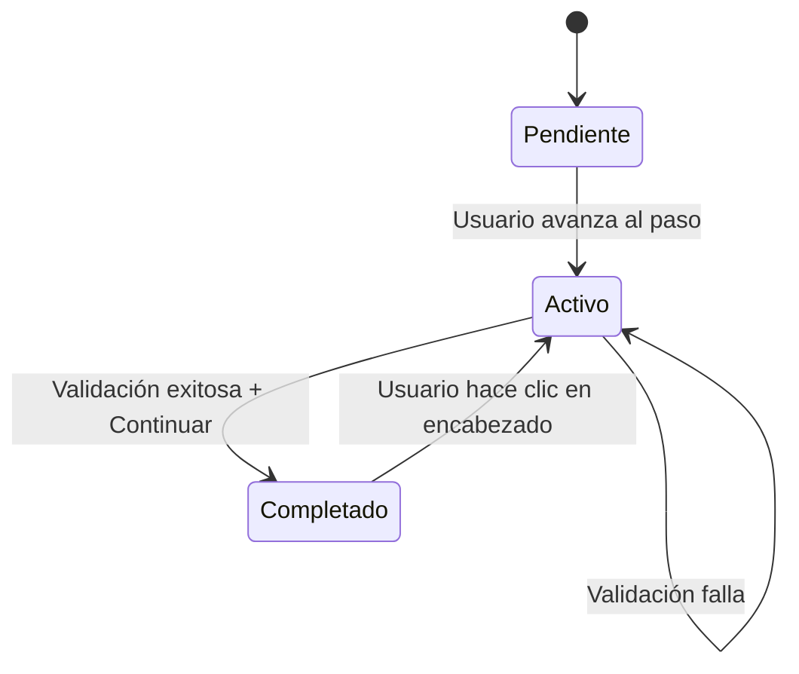

# Documento de Diseño - Wizard con Acordeones para Publicación

## Resumen

Este diseño transforma el formulario de publicación actual en una interfaz wizard progresiva usando acordeones expandibles. La solución mantiene la estructura HTML existente del formulario pero reorganiza los pasos en componentes acordeón con lógica JavaScript para controlar la navegación, validación y estados visuales.

## Arquitectura

### Estructura de Componentes

```
┌─────────────────────────────────────────┐
│     Barra de Progreso (Progress Bar)   │
│     [████████░░░░░░░░] Paso 2 de 5     │
└─────────────────────────────────────────┘
┌─────────────────────────────────────────┐
│ ✅ Paso 1: Tipificación                │
│    Resumen: Chocado                     │  ← Colapsado
└─────────────────────────────────────────┘
┌─────────────────────────────────────────┐
│ ✏️ Paso 2: Tipo de venta               │  ← Expandido
│ ┌─────────────────────────────────────┐ │
│ │  [Contenido del formulario]         │ │
│ │  ...campos del paso...              │ │
│ │                                     │ │
│ │  [Anterior] [Continuar →]          │ │
│ └─────────────────────────────────────┘ │
└─────────────────────────────────────────┘
┌─────────────────────────────────────────┐
│ ⏳ Paso 3: Datos del vehículo          │  ← Deshabilitado
└─────────────────────────────────────────┘
┌─────────────────────────────────────────┐
│ ⏳ Paso 4: Fotos                        │  ← Deshabilitado
└─────────────────────────────────────────┘
┌─────────────────────────────────────────┐
│ ⏳ Paso 5: Promoción                    │  ← Deshabilitado
└─────────────────────────────────────────┘
```

### Flujo de Estados



## Componentes e Interfaces

### 1. Barra de Progreso

**Ubicación:** Parte superior del formulario, antes de los acordeones

**Estructura HTML:**
```html
<div class="wizard-progress">
  <div class="wizard-progress-bar">
    <div class="wizard-progress-fill" style="width: 40%"></div>
  </div>
  <div class="wizard-progress-text">Paso 2 de 5</div>
</div>
```

**Propiedades:**
- `currentStep`: Número del paso actual (1-5)
- `totalSteps`: Total de pasos (5)
- `percentage`: Porcentaje de completitud calculado

**Métodos:**
- `updateProgress(stepNumber)`: Actualiza la barra visual y el texto

### 2. Acordeón de Paso (Step Accordion)

**Estructura HTML:**
```html
<div class="wizard-step" data-step="1" data-status="completed">
  <div class="wizard-step-header" tabindex="0" role="button" aria-expanded="false">
    <div class="wizard-step-icon">✅</div>
    <div class="wizard-step-title">
      <h3>Paso 1: Tipificación</h3>
      <p class="wizard-step-summary">Chocado</p>
    </div>
    <div class="wizard-step-chevron">▼</div>
  </div>
  <div class="wizard-step-content" style="display: none;">
    <!-- Contenido del formulario original -->
    <div class="wizard-step-body">
      <!-- Campos del paso -->
    </div>
    <div class="wizard-step-actions">
      <button type="button" class="btn" data-action="prev">← Anterior</button>
      <button type="button" class="btn primary" data-action="next">Continuar →</button>
    </div>
  </div>
</div>
```

**Estados del Paso:**
- `pending`: ⏳ Paso no iniciado (gris, deshabilitado)
- `active`: ✏️ Paso actual en edición (azul, expandido)
- `completed`: ✅ Paso completado (verde, colapsado con resumen)

**Atributos de Datos:**
- `data-step`: Número del paso (1-5)
- `data-status`: Estado actual (pending/active/completed)
- `data-required-fields`: JSON con campos requeridos del paso

### 3. Gestor de Wizard (WizardManager)

**Clase JavaScript Principal:**

```javascript
class WizardManager {
  constructor(formId) {
    this.form = document.getElementById(formId);
    this.steps = [];
    this.currentStep = 1;
    this.isEditMode = false;
    this.init();
  }
  
  init() {
    // Inicializar pasos
    // Configurar event listeners
    // Detectar modo edición
  }
  
  goToStep(stepNumber, skipValidation = false) {
    // Navegar a un paso específico
  }
  
  validateStep(stepNumber) {
    // Validar campos del paso
    // Retornar array de errores
  }
  
  completeStep(stepNumber) {
    // Marcar paso como completado
    // Generar resumen
    // Actualizar UI
  }
  
  expandStep(stepNumber) {
    // Expandir acordeón
    // Colapsar otros pasos
    // Hacer scroll
  }
  
  generateSummary(stepNumber) {
    // Generar texto de resumen basado en datos
  }
  
  updateProgressBar() {
    // Actualizar barra de progreso
  }
}
```

### 4. Validador de Pasos (StepValidator)

**Configuración de Validación por Paso:**

```javascript
const stepValidationRules = {
  1: { // Tipificación
    fields: ['tipificacion'],
    validator: (formData) => {
      const errors = [];
      if (!formData.get('tipificacion')) {
        errors.push('Debes seleccionar una tipificación');
      }
      return errors;
    }
  },
  2: { // Tipo de venta
    fields: ['tipo_venta'],
    validator: (formData) => {
      const errors = [];
      if (!formData.get('tipo_venta')) {
        errors.push('Debes seleccionar un tipo de venta');
      }
      return errors;
    }
  },
  3: { // Datos del vehículo
    fields: ['marca', 'modelo', 'anio', 'categoria_padre_id', 'subcategoria_id', 
             'region_id', 'comuna_id', 'descripcion'],
    validator: (formData) => {
      const errors = [];
      if (!formData.get('marca')?.trim()) errors.push('Marca del vehículo');
      if (!formData.get('modelo')?.trim()) errors.push('Modelo del vehículo');
      if (!formData.get('anio')) errors.push('Año del vehículo');
      if (!formData.get('categoria_padre_id')) errors.push('Categoría');
      if (!formData.get('subcategoria_id')) errors.push('Subcategoría');
      if (!formData.get('region_id')) errors.push('Región');
      if (!formData.get('comuna_id')) errors.push('Comuna');
      
      const descripcion = formData.get('descripcion')?.trim();
      if (!descripcion || descripcion.length < 20) {
        errors.push('Descripción (mínimo 20 caracteres)');
      }
      
      // Validar precio si es requerido
      const tipificacion = formData.get('tipificacion');
      const tipoVenta = formData.get('tipo_venta');
      if (tipificacion === 'chocado' || tipoVenta === 'completo') {
        if (!formData.get('precio')?.trim()) {
          errors.push('Precio del vehículo');
        }
      }
      
      return errors;
    }
  },
  4: { // Fotos
    fields: ['fotos[]'],
    validator: (formData, existingPhotos = 0) => {
      const errors = [];
      const newPhotos = formData.getAll('fotos[]').filter(f => f.size > 0).length;
      const totalPhotos = existingPhotos + newPhotos;
      
      if (totalPhotos === 0) {
        errors.push('Debes subir al menos 1 foto del vehículo');
      }
      
      return errors;
    }
  },
  5: { // Promoción
    fields: ['promocion'],
    validator: (formData) => {
      const errors = [];
      if (!formData.get('promocion')) {
        errors.push('Debes seleccionar un tipo de promoción');
      }
      return errors;
    }
  }
};
```

### 5. Generador de Resúmenes (SummaryGenerator)

**Función para cada paso:**

```javascript
const summaryGenerators = {
  1: (formData) => {
    const tip = formData.get('tipificacion');
    return tip === 'chocado' ? 'Chocado' : 'Siniestrado';
  },
  2: (formData) => {
    const tipo = formData.get('tipo_venta');
    return tipo === 'completo' ? 'Venta Directa' : 'Precio a convenir';
  },
  3: (formData) => {
    const marca = formData.get('marca');
    const modelo = formData.get('modelo');
    const anio = formData.get('anio');
    return `${marca} ${modelo} ${anio}`;
  },
  4: (formData, existingPhotos = 0) => {
    const newPhotos = formData.getAll('fotos[]').filter(f => f.size > 0).length;
    const total = existingPhotos + newPhotos;
    return `${total} foto${total !== 1 ? 's' : ''}`;
  },
  5: (formData) => {
    const promo = formData.get('promocion');
    if (promo === 'normal') return 'Normal (gratis)';
    if (promo === 'destacada15') return 'Destacada 15 días';
    if (promo === 'destacada30') return 'Destacada 30 días';
    return '';
  }
};
```

## Modelos de Datos

### Estado del Wizard

```javascript
{
  currentStep: 1,              // Paso actual activo
  completedSteps: [1, 2],      // Array de pasos completados
  stepData: {                  // Datos de cada paso
    1: { tipificacion: 'chocado' },
    2: { tipo_venta: 'completo' },
    3: { marca: 'Toyota', modelo: 'Corolla', ... },
    4: { photos: [...] },
    5: { promocion: 'normal' }
  },
  isEditMode: false,           // Si está en modo edición
  existingPhotos: 0            // Número de fotos existentes (modo edición)
}
```

## Manejo de Errores

### Tipos de Errores

1. **Errores de Validación:**
   - Se muestran en modal existente
   - Se resaltan campos con borde rojo
   - Se previene navegación al siguiente paso

2. **Errores de Navegación:**
   - Intento de acceder a paso no desbloqueado
   - Se muestra mensaje informativo
   - Se mantiene en paso actual

3. **Errores de Datos:**
   - Pérdida de datos al navegar
   - Se implementa auto-guardado en localStorage como respaldo

### Estrategia de Recuperación

```javascript
// Auto-guardado en localStorage
function autoSaveFormData() {
  const formData = new FormData(document.getElementById('form-publicar'));
  const data = Object.fromEntries(formData.entries());
  localStorage.setItem('wizard_draft', JSON.stringify(data));
}

// Recuperación al cargar
function restoreFormData() {
  const saved = localStorage.getItem('wizard_draft');
  if (saved) {
    const data = JSON.parse(saved);
    // Restaurar campos
  }
}
```

## Estrategia de Testing

### Tests Unitarios (Manuales)

1. **Navegación:**
   - Avanzar paso a paso completando campos
   - Retroceder a pasos anteriores
   - Intentar acceder a pasos bloqueados

2. **Validación:**
   - Intentar avanzar sin completar campos
   - Completar campos parcialmente
   - Validar cada tipo de campo

3. **Resúmenes:**
   - Verificar resumen correcto en cada paso
   - Editar paso completado y verificar actualización

4. **Modo Edición:**
   - Cargar publicación existente
   - Verificar todos los pasos accesibles
   - Verificar resúmenes pre-poblados

5. **Responsive:**
   - Probar en móvil (< 768px)
   - Probar en tablet (768px - 1024px)
   - Probar en desktop (> 1024px)

6. **Dark Mode:**
   - Activar dark mode
   - Verificar contraste y legibilidad
   - Verificar íconos y estados

### Tests de Integración

1. **Flujo Completo:**
   - Crear publicación desde inicio hasta envío
   - Guardar borrador en diferentes pasos
   - Editar publicación existente

2. **Persistencia:**
   - Navegar entre pasos y verificar datos
   - Recargar página y verificar auto-guardado
   - Guardar borrador y recuperar

## Consideraciones de Rendimiento

### Optimizaciones

1. **Lazy Loading de Imágenes:**
   - Cargar previews solo cuando se expande Paso 4

2. **Debouncing:**
   - Auto-guardado con debounce de 2 segundos
   - Validación en tiempo real con debounce de 500ms

3. **Animaciones:**
   - Usar CSS transforms en lugar de height para animaciones
   - Hardware acceleration con `will-change`

4. **Event Delegation:**
   - Un solo listener para todos los botones de navegación
   - Un solo listener para todos los encabezados de acordeón

## Decisiones de Diseño

### 1. ¿Por qué acordeones en lugar de tabs?

Los acordeones permiten:
- Mejor experiencia en móviles (scroll vertical natural)
- Visualización de resúmenes sin cambiar de vista
- Animaciones más fluidas
- Menos espacio horizontal requerido

### 2. ¿Por qué validación por paso en lugar de al final?

- Reduce frustración del usuario
- Feedback inmediato
- Menor probabilidad de errores acumulados
- Mejor UX según principios de diseño progresivo

### 3. ¿Por qué mantener estructura HTML existente?

- Menor riesgo de romper funcionalidad existente
- Más rápido de implementar
- Facilita rollback si es necesario
- Mantiene compatibilidad con backend

### 4. ¿Por qué permitir edición de pasos completados?

- Flexibilidad para el usuario
- Corrección de errores sin reiniciar
- Mejor experiencia que wizard rígido
- Común en formularios largos modernos

## Diagramas

### Flujo de Navegación

```
Inicio
  ↓
Paso 1 (Expandido)
  ↓ [Continuar + Validación]
Paso 1 (Completado) → Paso 2 (Expandido)
  ↓ [Continuar + Validación]
Paso 2 (Completado) → Paso 3 (Expandido)
  ↓ [Continuar + Validación]
Paso 3 (Completado) → Paso 4 (Expandido)
  ↓ [Continuar + Validación]
Paso 4 (Completado) → Paso 5 (Expandido)
  ↓ [Enviar a revisión]
Formulario Enviado
```

### Interacción de Componentes

```
┌─────────────────┐
│  WizardManager  │
└────────┬────────┘
         │
         ├──────────┐
         │          │
    ┌────▼────┐  ┌──▼──────────┐
    │ Step    │  │  Progress   │
    │Validator│  │  Bar        │
    └────┬────┘  └─────────────┘
         │
    ┌────▼────────┐
    │  Summary    │
    │  Generator  │
    └─────────────┘
```

## Integración con Sistema Existente

### Cambios Mínimos Requeridos

1. **HTML:** Envolver cada `.card` en estructura de acordeón
2. **CSS:** Agregar estilos de wizard (no modificar existentes)
3. **JavaScript:** Agregar lógica de wizard (no modificar validación existente)
4. **Backend:** Sin cambios (mantiene mismo endpoint y estructura de datos)

### Puntos de Integración

- Mantener funciones existentes: `guardarBorrador()`, `enviarFormulario()`
- Mantener validación existente: `validarFormulario()`
- Mantener modal existente: `mostrarModalValidacion()`
- Agregar nueva lógica de wizard sin eliminar código existente

## Plan de Rollout

### Fase 1: Implementación Base
- Estructura HTML de acordeones
- CSS básico y animaciones
- Lógica de navegación

### Fase 2: Validación y Resúmenes
- Integrar validación por paso
- Implementar generación de resúmenes
- Barra de progreso

### Fase 3: Refinamiento
- Modo edición
- Dark mode
- Responsive
- Accesibilidad

### Fase 4: Testing y Ajustes
- Testing manual completo
- Ajustes de UX
- Optimizaciones de rendimiento
